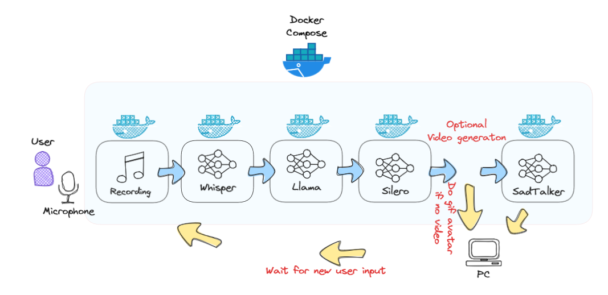

# EVA (The Elderly Virtual Assistant)
# Table of Contents

- [EVA (The Elderly Virtual Assistant)](#eva-the-elderly-virtual-assistant)
  - [Overview](#overview)
  - [Modules](#modules)
  - [Process Flow](#process-flow)
  - [Getting Started](#getting-started)
  - [Usage](#usage)
  - [Contributing](#contributing)
  - [License](#license)
  - [Acknowledgments](#acknowledgments)

## Overview

In the era of technology, the importance of human interaction, especially for the elderly, cannot be understated. EVA, our Elderly Virtual Assistant, is an innovative project aimed at providing companionship to the elderly through an interactive avatar. This avatar uses advanced artificial intelligence techniques to communicate, provide assistance, and engage in meaningful interactions.

## Modules

EVA consists of the following main modules:

1. **Client Module**: Responsible for recording user input and providing audio feedback. This is the primary interaction point for the user.
2. **Transcription Model**: Transcribes the recorded audio into text to allow further processing.
3. **LLama2 Processing**: Takes the transcribed text and processes it to generate an appropriate response for the user.
4. **Text-to-Voice Generation**: Converts the generated text response back into audio.
5. **Avatar Visualization**: Visual representation of EVA, providing a more immersive experience by playing the audio responses.

## Process Flow

1. The user interacts with the **Client Module** by providing a voice input.
2. This voice input is transcribed into text by the **Transcription Model**.
3. The transcribed text is then processed by **LLama2** to craft a suitable response.
4. This textual response is converted into audio via the **Text-to-Voice Generation** module.
5. Finally, the **Avatar Visualization** module plays back the audio response, visually represented by our avatar, EVA.





### Orchestration of services within the pipeline


## Getting Started

### Prerequisites

AckBefore you can run EVA, ensure you have the following software and libraries installed:

- **Python**: EVA is built using Python. Ensure you have Python 3.10 or newer installed.
- **Poetry**: This project uses Poetry for dependency management. Install it using the instructions from [Poetry's official website](https://python-poetry.org/docs/).
- **Docker & Docker Compose**: EVA uses Docker containers managed by Docker Compose. Install Docker and Docker Compose from [Docker's official website](https://www.docker.com/get-started).

   
### Installation

1. **Clone the Repository**:
   ```bash
   git clone https://github.com/buzzCraft/ACIT4040-AI-Project.git
   cd ACIT4040-AI-Project
   ```

2. **Build and Start Docker Containers**:
   Use Docker Compose to build and start all the necessary containers:

   ```bash
   docker-compose up --build
   ```
    Remember, the detailed logging has been provided to help you understand the inner workings of the 
    system and to assist in troubleshooting. Always refer to the logs if you encounter any unexpected 
    behavior. So watch the INFO in the output terminal when running the `docker-compose up --build` command 
    and after running the `eva` script.
## Usage

1. **Interacting with EVA**:
   With the containers up and running, you can start the main launcher script to interact with EVA, this script forwards ports so you can run the program locally.
   The script has the command `ssh -L 7000:localhost:4999 -L 7002:localhost:5002 username@server_address`

   ```bash
   eva
   ```

   - Speak into your microphone to provide a voice input.
   - EVA's avatar will visually represent the response and play the audio feedback.
   - Example commands include:
     - "Tell me a joke."
     - "What's the weather like today?"
     - "Play some music."
   
3. **Stopping the Service**:
   To stop the service and bring down the containers, you can use:

   ```bash
   docker-compose down
   ```
  this can be done in a different commandline interface or interrup by ctl + C

## Demo

To speed up inference, we choose to bypass the SadTalker model in our live demo as can be seen in the first video.
The second video shows an example of the SadTalker model in action, where the timedelay is edited out (ADD THE TIME IT TOOK).

VIDEO 1

VIDEO 2

## Contributing

We welcome contributions! Please refer to GitHub Community Guidelines at [CONTRIBUTING.md](https://docs.github.com/articles/github-community-guidelines) before submitting a pull request.

## License

This project is licensed under MIT License - see the [LICENSE.md](LICENSE) file for details.

## Contributors

- Jackson Herbert Sinamenye
- Vebjørn Berstad
- Pratima Kumari
- Majdi Omar Alali
- Alexander Theo Strand
- Alexander Soudae
- Majdi Alali

